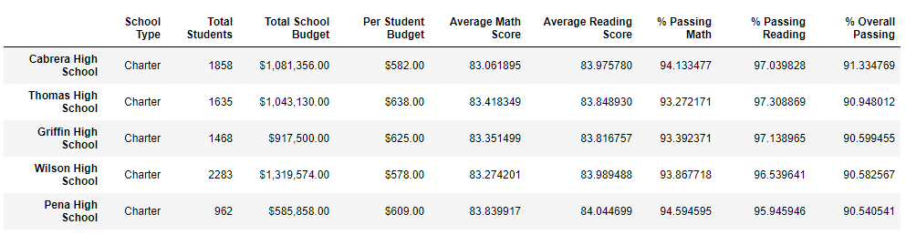
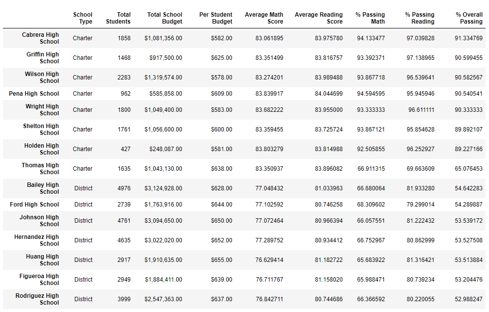
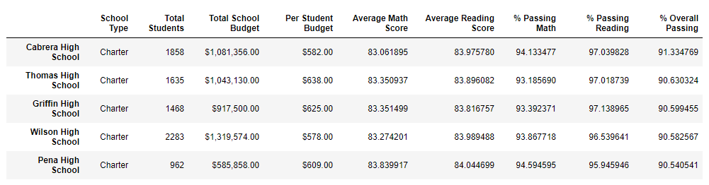

# School_District_Analysis

## Overview 
This analysis project is to prepare standardizing test data for analysis and gain insights about school performance trends to help the school board make strategic decisions regarding school budgets and priorities. The school board has notified the analyst regarding evidence of academic dishonesty within the data set in regards to altered reading and math scores for Thomas High School ninth graders.

### Purpose 
The purpose of this analysis is to replace the math and reading scores for Thomas High School (THS) with NaNs while keeping the rest of the data intact, determine how these changes have affected the analysis and report the following:

* District School Summary (describing total students, total budget, average scores)
* School Summary (describing the above for each school)
* Scores by Grade
* Scores by School Budget
* Scores by School Size
* Scores by School Type

## Analysis 

Data Source: [Schools Data Set](Resources/school_data.csv),
            [Students Data Set](Resources/student_data.csv)

Software used: Python 3.7.6, Jupyter Notebooks

Analysis Code: [PyCitySchools_Challenge](PyCitySchools_Challenge.ipynb)

The scores for THS grade niners were replaced with NaNs. However, since this would've affected the analysis, THS ninth grade students were removed during the analysis. 

The total student count was recalculated by subtracting the number of THS ninth-grade students from the total student count. This new total student count was used to conduct the analysis. 

## Results

Following are the results on how each of the seven school district metrics was affected by the changes in the data.

### District Summary

| Description  |  Screenshots       |
|-----------|----------|        
|District summary with the original data set   ||
|District summary after replacing THS grade 9 scores with NaN||

As shown in the table above, there is a very slight difference (0.1 for Average Math Score, 0.2 for % Passing Math, 0.3 for % Passing Reading and 0.1 for % Overall Passing) in the values for average scores, percentages and overall passing percentage. Therefore, the school district summary wasn't significantly affected by the changes made to the data. 

### School Summary

The summaries for schools in this DataFrame were unaffected except for Thomas High School.  

| Description  |  Screenshots       |
|----|----|
|THS school summary with original data set||
|After replacing THS 9th Grade Scores with NaN||
|After removing THS 9th grade students from the analysis||

In the above comparison, it is evident that the changes in the data would've affected the performance summary for THS. THS's overall passing percentage was at 90.9 % before replacing the 9th grade values and dropped to 65% after. However, summary for THS was recalculated by disregarding the grade 9 scores entirely, which brought THS's overall passing percentage back up to 90.6 %. Therefore, the THS school summary also remained unaffected by the changes in the data set. 

##### School Performance Standing

| Description  |  Screenshots       |
|----|----|
|School performance ranking with original data set||
|After replacing THS 9th Grade Scores with NaN||
|After removing THS 9th grade scores from the analysis||

Relative to other schools, THS was in second place in regards to school performance in the district before the changes were made to the data set. After replacing THS's grade 9 scores with NaN, it fell to 8th place. However, after the THS grade 9 students were removed from the analysis, THS climbed back to its original standing of second place. 

 
### Math and Reading Scores by Grade

| Math Scores | Reading Scores|
|-------------|---------------|
| | | 

The results for math and reading scores by grade for each school remained unchanged except the average scores for THS grade 9 students were replaced with NaN.
    
### Scores by School Spending

The results (above image) for scores by school spending were unaffected by the changes in the data. (Since the dataframe looked exactly the same, only the final screenshot is shared above.)

### Scores by School Size

The results (above image) for scores by school size were unaffected by the changes in the data. (Since the dataframe looked exactly the same, only the final screenshot is shared above.)

### Scores by School Type

The result for scores by school type was unaffected by the changes in the data. (Since the dataframe looked exactly the same, only the final screenshot is shared above.)

## Summary

In conclusion, at a whole, the analysis was unaffected by the changes made to the data. The District Summary Results varied by 0.1 - 0.3 points to the original values, however this is insignificant since these changes did not affect remaining analysis. Schools retained their place in the school performance rankings and the analysis results for scores by school spending, size and type remained unaffected as well.  
